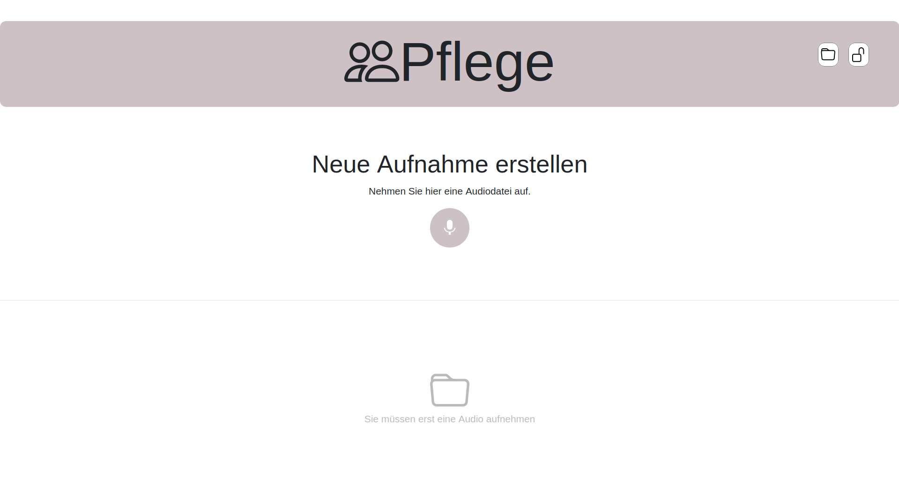
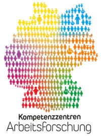

# SIS WebApp

This repository contains a demo web application for automated, speech-based documentation of the **Structured Information Sheet (SIS)**.

The SIS is a form used during an admission interview between a caregiver and a patient to document disease-related and care-specific information. This information is then used to derive an initial care and intervention plan. The [SIS document](https://www.ein-step.de/fileadmin/content/documents/SIS-stationaer_ausfuellbar_A3_V2.0_2017.pdf) is divided into the following seven categories:

- **Current Situation**
- **Cognition and Communication**
- **Mobility**
- **Diseases**
- **Self-Sufficiency**
- **Social Relations**
- **Housekeeping**

<!-- Uncomment the following image to display the SIS document overview -->
<!-- 
*Figure: SIS document showing the different categories.* -->

These admission interviews are time-consuming and can cause significant stress for caregivers partly due to the lack of standardization in completing the form. Our goal is to simplify the SIS documentation process with a speech-based AI system that reduces stress while ensuring a higher quality standard. The application functions as a dictation tool, automatically categorizing spoken input into the appropriate SIS sections.


*Figure 1: Frontend design of the web application for recording new SIS-related audio files.*

## Applied Tools and Frameworks

This web application is designed to seamlessly integrate the frontend, backend, and AI model serving using Docker containers. It leverages the following technologies:

- **Vue.js**: A progressive JavaScript framework for building user interfaces.
- **Python REST with Flask**: Communication interface between frontend and backend
- **PyTorch**: A framework for building and training machine learning models, used here for serving AI models.
- **Docker Compose**: A tool for defining and running multi-container Docker applications.

## Setup

Before building the application with Docker Compose, ensure that you have downloaded the source code and obtained the model files (provided in `.mar` format for TorchServe). Place the model files in the `model-store` directory within the TorchServe folder.

### Prerequisites

- [Docker](https://docs.docker.com/get-docker/) installed on your system.
- [Docker Compose](https://docs.docker.com/compose/install/) installed.

### Installation Steps

1. **Clone the Repository**

    ```bash
    git clone https://github.com/bo-i-t/sis-demonstrator.git
    ```

2. **Download the Model Files**

    Download the archived `.mar` model files from this link and move them to the TorchServe model store:

    ```bash
    mv <downloaded-model-path>/sis-models/* <project-root-path>/torchserve/model-store/
    ```

3. **Navigate to the Project Directory**

    ```bash
    cd sis-demonstrator/humaine_vue_webapp
    ```

4. **Build and Run the Docker Containers**

    Use Docker Compose to build and run the containers:

    ```bash
    docker-compose up --build -d
    ```

    *Note: The initial build may take a few minutes, especially if backend images need to be built.*

5. **Access the Web Application**

    Once the containers are running, open your browser and navigate to:

    [http://localhost:8080/humaine/](http://localhost:8080/humaine/)

## Related Publication

This demonstrator tool implements a model that we fine tuned with a novel approached, Conditional Label Smoothing, which is described in detail in our paper:
**Conditional Label Smoothing For LLM-Based Data Augmentation in Medical Text Classification**  


For citation purposes, you can use the following BibTeX entry:
```
bibtex
@CLS{10832347,
  author={Becker, Luca and Pracht, Philip and Sertdal, Peter and Uboreck, Jil and Bendel, Alexander and Martin, Rainer},
  booktitle={2024 IEEE Spoken Language Technology Workshop (SLT)}, 
  title={Conditional Label Smoothing For LLM-Based Data Augmentation in Medical Text Classification}, 
  year={2024},
  volume={},
  number={},
  pages={833-840},
  keywords={Smoothing methods;Large language models;Conferences;Noise;Text categorization;Pipelines;Training data;Artificial neural networks;Data augmentation;Data models;data augmentation;label smoothing;large language models;text classification;gpt},
  doi={10.1109/SLT61566.2024.10832347}}
```

## Acknowledgements

This work was funded by the German Federal Ministry of Education and Research (BMBF) within the “Innovations for Tomorrow’s Production, Services, and Work” program (02L19C200). The project is implemented by the Project Management Agency Karlsruhe (PTKA).

<p align="left">
  
  
</p>

## License

*This project is licensed under the GNU General Public License v3.0 – see the LICENSE file for details.*

